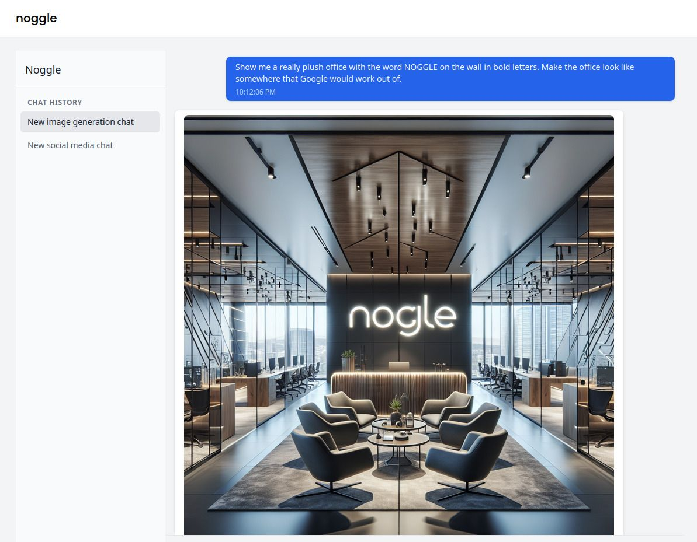

# noggle AI




## What is Noggle?

Introducing noggle™, the groundbreaking enterprise solution that's revolutionising how businesses interact with artificial intelligence! Our proprietary QUANTUM-SYNERGY™ platform (which is definitely not just a basic wrapper around the OpenAI API) harnesses the power of military-grade AI technology to transform your business operations through our innovative "ask-an-AI-to-ask-an-AI" architecture. noggle™ seamlessly integrates with your existing workflow by adding an unnecessary layer between you and ChatGPT, while our cutting-edge NEURAL-BRIDGE™ technology (a REST API call) ensures your prompts are delivered with unprecedented efficiency, enhanced by our proprietary "adding 'please' to your prompts" algorithm. 

## What?

Just kidding, it's a thin wrapper around OpenAI that is free for anyone to download and use.

## Why the name Noggle?

Because it's Not Joggle.

## What's Joggle?

A thin wrapper around the OpenAI API that purports to be the next Google.

## So what does it do?

The same as Joggle AI - it's a thin wrapper around the OpenAI API that allows you to add the details of your business (name, location, etc.) and then you can write blog posts, social media posts, generate images, etc.

## Do you need hundreds of thousands of pounds of seed funding?

No, it's already built and ready to go. You can use it for free for your own business or you can sell it to other businesses. You're welcome.

## What do I need to get started?

An OpenAI account. When you set up your account, create a project and an API key. Then put your API keys into the .env file to get started.

## Can I use this to make money?

Do what you want with this - it's licensed under the MIT License which means that you're free to rip it apart and use it for your own business. Hell, start your own AI business and try to get seed funding if you like.

## And it's free?

Free AND open source.

## Features

- 💬 Real-time chat interface with streaming responses
- 🖼️ Image generation support
- 💼 Unlimited multi-business support
- 📝 Different chat types with customizable system prompts
- 🎯 Simple SQLite database for easy setup
- 🐳 Docker support for easy deployment

## Quick Start

1. Clone the repository:

```bash
git clone <repo-url>
cd noggle
```

2. Create your environment file:
```bash
cp .env.example .env
```

3. Add your OpenAI API key to the `.env` file:
```env
OPENAI_API_KEY=your_api_key_here
OPENAI_ORG_ID=your_org_id_here  # Optional
OPENAI_PROJECT_ID=your_project_id_here  # Optional
```

4. Start the application using Docker:
```bash
docker compose up --build
```

The application will be available at `http://localhost:3000`.

## Database

Noggle uses SQLite by default for simplicity and ease of setup. The database file is automatically created and seeded when you first run the application. The SQLite database file is persisted through a Docker volume named `sqlite_data`.

### Why SQLite?

- **Simple Setup**: No separate database server required
- **Zero Configuration**: Works out of the box
- **Reliable**: ACID compliant and highly stable
- **Portable**: Entire database is in a single file

## Authentication

By default, Noggle does not include user authentication to keep the initial setup simple. However, you could easily add authentication using:

- [SvelteKit Auth](https://kit.svelte.dev/docs/authentication)
- [Lucia Auth](https://lucia-auth.com/)
- [Auth.js](https://authjs.dev/)

## Technology Stack

- **Frontend & Backend**: SvelteKit
- **Database**: SQLite with Prisma ORM
- **Styling**: Tailwind CSS
- **Container**: Docker
- **AI Integration**: OpenAI API

## Project Structure

```
noggle/
├── src/
│   ├── routes/          # SvelteKit routes
│   ├── lib/            # Shared utilities
│   └── app.html        # App template
├── prisma/
│   └── schema.prisma   # Database schema
├── docker-compose.yaml
└── Dockerfile
```

## Development

To run the application in development mode without Docker:

1. Install dependencies:
```bash
npm install
```

2. Generate Prisma client:
```bash
npx prisma generate
```

3. Run migrations:
```bash
npx prisma migrate dev
```

4. Start the development server:
```bash
npm run dev
```

## Production Deployment

For production deployment, consider:

1. Adding authentication
2. Switching to a production-grade database (PostgreSQL, MySQL)
3. Setting up proper SSL/TLS
4. Implementing rate limiting
5. Adding monitoring and logging

## License

MIT License